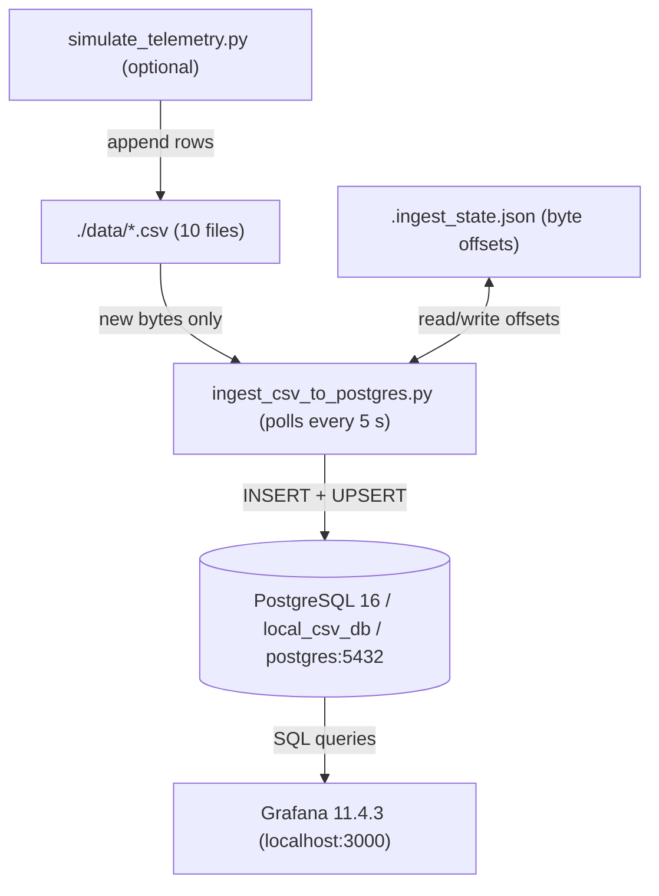

# 01 · System Overview

## What This Is

A **near-real-time spacecraft telemetry dashboard**. Two satellites (Sat-A, Sat-B) emit sensor readings—battery voltage, CPU temperature, link quality, etc.—every few seconds. Those readings flow into a database and appear on live Grafana dashboards within ~10 seconds.

The system is designed to run entirely on a single laptop via Docker. No cloud, no Kafka, no message broker. Just PostgreSQL, Grafana, and a Python process watching files.

---

## The Core Abstraction

Think of it as a **tail-and-insert loop**:

```
while True:
    for each CSV file:
        read new lines since last read
        insert them into Postgres
    sleep(5 seconds)
```

Everything else—deduplication, indexing, dashboards—is built around making that loop robust and queryable.

---

## Why CSV as the Input Format

CSV files are the lowest common denominator for telemetry export. Ground systems, simulators, and test harnesses all speak CSV. The pipeline accepts any CSV that has these six columns:

```
timestamp, satellite, subsystem, metric_name, metric_value, status
```

No schema negotiation. No custom protocol. If a tool can write a CSV, it feeds this pipeline.

---

## What the System Does NOT Do

- No real-time streaming (Kafka, MQTT). Files are polled.
- No authentication beyond Grafana's local admin/admin.
- No horizontal scaling. One Postgres, one ingestor process.
- No alerting outside Grafana's built-in alert rules.

These are not bugs. The system is scoped for **local development and demo use**, not production fleet operations.

---

## Components at a Glance



---

## Data Sources in This System

There are two ways data enters the CSV files:

**1. Simulator** (`scripts/simulate_telemetry.py`)
Generates synthetic orbital telemetry using sinusoidal functions. Orbits with 90-minute periods, noise, threshold-based status assignment. Use this for demos or when you don't have real data.

**2. External tools**
Any process that appends rows to the CSVs in `./data/`. The ingestor only reads new bytes since the last poll, so appending from another process is safe.

---

## Satellite / APID Topology

The system models two spacecraft, each with five subsystems:

| APID | Subsystem | Signals |
|------|-----------|---------|
| 100 | power | battery_voltage, solar_current |
| 101 | thermal | panel_temp, cpu_temp |
| 102 | obc (onboard computer) | cpu_usage, memory_usage |
| 103 | comms | link_quality, downlink_rate_kbps |
| 104 | adcs (attitude control) | reaction_wheel_rpm, magnetometer_nt, attitude_error_deg, gyro_rate_dps |

Each (spacecraft, APID) pair has its own CSV file: `sat_a_apid_100.csv`, `sat_b_apid_104.csv`, etc.

---

## Status Values

Every row carries a status flag:

| Status | Meaning |
|--------|---------|
| `NOMINAL` | Signal is within expected range |
| `WARNING` | Signal is approaching a limit |
| `CRITICAL` | Signal has exceeded a limit |

Grafana dashboards color-code these. The database has a partial index on non-NOMINAL rows so alert queries are fast.

---

## Lifespan of a Telemetry Reading

1. Simulator (or external tool) appends a CSV row to `sat_a_apid_100.csv`
2. Ingestor wakes up (≤5s later), reads the new bytes
3. Row is hashed (SHA-256) and inserted into `telemetry_history`
4. The same row upserts `telemetry_latest` (overwrites the previous reading for that signal)
5. Grafana queries `telemetry_history` for time-series and `telemetry_latest` for current state
6. After 30 days, the `telemetry_history` row is purged automatically

Next: [02 · Data Flow →](02-data-flow.md)
