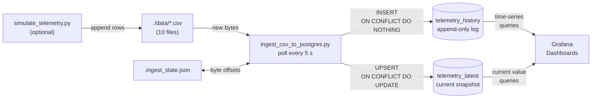
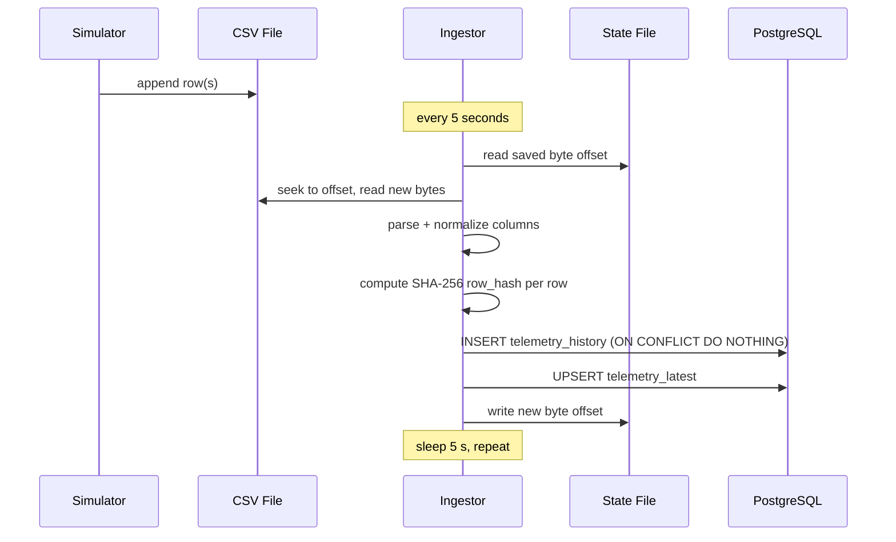

# 02 · Data Flow

## End-to-End Pipeline



---

## Step 1: CSV Production

Files live in `./data/`. Each file covers one (spacecraft, APID) pair.

```
sat_a_apid_100.csv
──────────────────────────────────────────────────────────────────
timestamp,apid,satellite,subsystem,metric_name,metric_value,status
2026-04-22T10:00:00Z,100,Sat-A,power,battery_voltage,28.4,NOMINAL
2026-04-22T10:00:05Z,100,Sat-A,power,battery_voltage,28.3,NOMINAL
2026-04-22T10:00:05Z,100,Sat-A,power,solar_current,4.1,NOMINAL
```

Files are append-only during normal operation. The ingestor handles both append-only and full-rewrite patterns (via byte-offset reset on file shrinkage detection).

---

## Ingestion Sequence (per poll cycle)



---

## Step 2: Byte-Offset Tracking

The ingestor doesn't scan full files on every poll. It tracks where it left off in `.ingest_state.json`:

```json
{
  "sat_a_apid_100.csv": 14802,
  "sat_a_apid_101.csv": 13441,
  "sat_b_apid_104.csv": 31200
}
```

On each poll:
1. Open file, check current size
2. If size < saved offset → file was truncated, reset offset to 0 (re-read from header)
3. Seek to saved offset, read remaining bytes
4. Parse those bytes as CSV rows
5. Save new offset (= current file size)

This means a 30-day CSV file processes in microseconds per poll—only new bytes are read.

---

## Step 3: Row Parsing and Normalization

The ingestor normalizes column names to match the database schema:

| CSV Column | DB Column | Notes |
|------------|-----------|-------|
| `timestamp` | `observed_at` | Parsed to TIMESTAMPTZ |
| `satellite` | `spacecraft` | Text |
| `metric_name` | `signal_name` | Text |
| `metric_value` | `signal_value` | Cast to DOUBLE PRECISION |
| `subsystem` | `subsystem` | Text |
| `status` | `status` | NOMINAL / WARNING / CRITICAL |
| `apid` | `apid` | INTEGER, optional |

Rows missing required columns are skipped with a warning log. No partial inserts.

---

## Step 4: Deduplication via Row Hash

Before any insert, each row is hashed:

```python
row_hash = sha256(
    f"{observed_at}{spacecraft}{subsystem}{signal_name}{signal_value}{status}"
    .encode()
).hexdigest()
```

This hash is stored in `telemetry_history.row_hash` with a UNIQUE constraint.

Inserts use `ON CONFLICT (row_hash) DO NOTHING`.

**Why this matters:** If you restart the ingestor, reprocess a file, or accidentally re-read already-processed rows, nothing is double-inserted. The hash is the single source of truth for "have I seen this row before."

---

## Step 5: Dual Write

Every row goes to two tables simultaneously (in the same transaction):

### telemetry_history (append-only)
```sql
INSERT INTO telemetry_history
  (observed_at, spacecraft, subsystem, apid, signal_name, signal_value,
   signal_unit, status, source_file, row_hash)
VALUES (...)
ON CONFLICT (row_hash) DO NOTHING;
```

This is the historical record. Grafana queries it for time-series charts.

### telemetry_latest (upserted)
```sql
INSERT INTO telemetry_latest
  (spacecraft, subsystem, signal_name, apid, signal_value,
   signal_unit, status, observed_at, updated_at)
VALUES (...)
ON CONFLICT (spacecraft, subsystem, signal_name) DO UPDATE SET
  signal_value = EXCLUDED.signal_value,
  status = EXCLUDED.status,
  observed_at = EXCLUDED.observed_at,
  updated_at = NOW();
```

This is the current snapshot. Grafana queries it for "what is the battery voltage right now" panels.

---

## Step 6: Grafana Queries

Grafana connects to PostgreSQL via the provisioned `telemetry_pg` data source.

**Time-series panel (from telemetry_history):**
```sql
SELECT
  observed_at AS time,
  signal_value,
  spacecraft || ' › ' || signal_name AS metric
FROM telemetry_history
WHERE $__timeFilter(observed_at)
  AND signal_name = 'battery_voltage'
ORDER BY observed_at;
```

**Current state panel (from telemetry_latest):**
```sql
SELECT spacecraft, signal_name, signal_value, status, observed_at
FROM telemetry_latest
WHERE subsystem = 'power'
ORDER BY spacecraft, signal_name;
```

**Alert panel (partial index hit):**
```sql
SELECT spacecraft, signal_name, signal_value, status
FROM telemetry_history
WHERE status != 'NOMINAL'
  AND $__timeFilter(observed_at)
ORDER BY observed_at DESC
LIMIT 100;
```

---

## Step 7: Data Retention

The ingestor runs a purge ~once per hour (every 720 poll cycles):

```sql
DELETE FROM telemetry_history
WHERE observed_at < NOW() - INTERVAL '30 days';
```

`TELEMETRY_RETENTION_DAYS` in `.env` controls the window. `telemetry_latest` is never purged (it's a fixed-size snapshot keyed on spacecraft+subsystem+signal).

---

## Latency Budget

| Stage | Typical latency |
|-------|----------------|
| Simulator writes a row | ~0ms |
| Ingestor wakes up (worst case) | 5,000ms |
| Read + hash + insert | ~50ms for 100 rows |
| Grafana refresh interval | 5,000–10,000ms |
| **Total end-to-end** | **5–15 seconds** |

This is a polling pipeline. If you need sub-second latency, the architecture would need to change (LISTEN/NOTIFY or a streaming queue). For local telemetry monitoring, 5–15s is fine.

---

Next: [03 · Database Design →](03-database-design.md)
