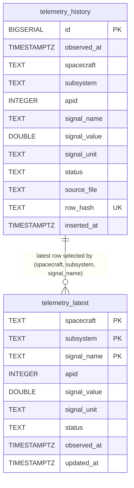

# 03 · Database Design

## The Two-Table Pattern

The schema has two tables that serve fundamentally different query patterns:

```
telemetry_history          telemetry_latest
─────────────────          ─────────────────
Append-only log            Current state snapshot
Grows over time            Fixed-size (one row per signal)
Queried for trends         Queried for "right now"
Indexed on time            Keyed on (spacecraft, subsystem, signal)
Purged after 30 days       Never purged
```

This is the same pattern used by time-series databases like InfluxDB: one table for the firehose, one table for the ticker.



---

## telemetry_history

The main table. Every sensor reading ever ingested lives here.

```sql
CREATE TABLE IF NOT EXISTS telemetry_history (
    id            BIGSERIAL PRIMARY KEY,
    observed_at   TIMESTAMPTZ NOT NULL,
    spacecraft    TEXT NOT NULL,
    subsystem     TEXT NOT NULL,
    apid          INTEGER,
    signal_name   TEXT NOT NULL,
    signal_value  DOUBLE PRECISION NOT NULL,
    signal_unit   TEXT,
    status        TEXT NOT NULL DEFAULT 'NOMINAL',
    source_file   TEXT,
    row_hash      TEXT UNIQUE NOT NULL,
    inserted_at   TIMESTAMPTZ NOT NULL DEFAULT NOW()
);
```

**Column decisions:**

- `observed_at` vs `inserted_at`: The distinction matters. `observed_at` is when the spacecraft made the measurement (from CSV). `inserted_at` is when our pipeline processed it. Grafana time-series panels always use `observed_at`. `inserted_at` is for debugging ingestion lag.

- `signal_value DOUBLE PRECISION`: All metrics are numeric. Text-encoded signal values (enums, flags) are not supported. Encode categorical signals as integers if needed.

- `row_hash TEXT UNIQUE`: This is the deduplication key. SHA-256 of the row's content. The UNIQUE constraint is enforced at the database level, not just application level.

- `apid INTEGER`: Optional. Populated when the CSV includes an `apid` column. Allows querying by fleet-wide subsystem ID without knowing the spacecraft name.

- `source_file TEXT`: Which CSV file this row came from. Useful for debugging when a reading looks wrong.

---

## telemetry_latest

A fixed-size table. At most one row per (spacecraft, subsystem, signal_name) triple.

```sql
CREATE TABLE IF NOT EXISTS telemetry_latest (
    spacecraft    TEXT NOT NULL,
    subsystem     TEXT NOT NULL,
    signal_name   TEXT NOT NULL,
    apid          INTEGER,
    signal_value  DOUBLE PRECISION NOT NULL,
    signal_unit   TEXT,
    status        TEXT NOT NULL DEFAULT 'NOMINAL',
    observed_at   TIMESTAMPTZ NOT NULL,
    updated_at    TIMESTAMPTZ NOT NULL DEFAULT NOW(),
    PRIMARY KEY (spacecraft, subsystem, signal_name)
);
```

No auto-increment ID. The primary key is the business key. When a new reading arrives for `(Sat-A, power, battery_voltage)`, the existing row is updated in-place, not appended.

With 2 spacecraft × 5 subsystems × ~3 signals each ≈ 30 rows total. This table never grows.

---

## Indexes

Four indexes on `telemetry_history`:

```sql
-- 1. Time-series scans (most common query pattern)
CREATE INDEX IF NOT EXISTS idx_telemetry_history_observed_at
ON telemetry_history (observed_at DESC);

-- 2. Per-spacecraft, per-signal time-series
CREATE INDEX IF NOT EXISTS idx_telemetry_history_spacecraft_signal
ON telemetry_history (spacecraft, signal_name, observed_at DESC);

-- 3. Per-APID queries (fleet-wide subsystem views)
CREATE INDEX IF NOT EXISTS idx_telemetry_history_apid
ON telemetry_history (apid, observed_at DESC);

-- 4. Partial index: only non-NOMINAL rows (alert queries)
CREATE INDEX IF NOT EXISTS idx_telemetry_history_alerts
ON telemetry_history (spacecraft, signal_name, observed_at DESC)
WHERE status != 'NOMINAL';
```

**Why the partial index?** Alert queries filter on `status != 'NOMINAL'`. In a healthy system, >95% of rows are NOMINAL. A full index scan wastes time on rows that will be filtered out. The partial index contains only the small fraction of rows that matter for alerts—making those queries dramatically faster as the table grows.

**Why `observed_at DESC`?** Dashboard queries almost always want the most recent data. DESC ordering means the most recent entries are physically at the top of the index, so `LIMIT` queries scan fewer index pages.

---

## Row Hash Design

```python
row_hash = sha256(
    f"{observed_at}{spacecraft}{subsystem}{signal_name}{signal_value}{status}"
    .encode()
).hexdigest()
```

The hash captures the six fields that define a unique measurement event. It excludes:
- `apid` (added later, backward compatibility)
- `signal_unit` (not always present in source CSVs)
- `source_file` (same data could come from different files during backfill)

If two rows hash to the same value, they represent the same physical measurement. Only one is kept.

**Edge case:** Two truly different measurements at the exact same millisecond, for the same signal, with the same value. These would collide. In practice this doesn't happen because measurements have physical variance, and the timestamp resolution (usually seconds) prevents true simultaneity.

---

## Data Retention

```sql
-- Runs ~hourly from the ingestor
DELETE FROM telemetry_history
WHERE observed_at < NOW() - INTERVAL '30 days';
```

30-day default. Configurable via `TELEMETRY_RETENTION_DAYS` env var.

After a large delete, run this manually to reclaim disk space:
```sql
VACUUM ANALYZE telemetry_history;
```

PostgreSQL's autovacuum will eventually do this, but manual `VACUUM ANALYZE` after bulk deletes prevents table bloat and keeps planner statistics fresh.

---

## Sizing Estimate

With 2 spacecraft × 5 APIDs × 3 signals = 30 signals, polling every 5 seconds:

```
30 signals × (60/5) rows/min × 60 min/hr × 24 hr/day = 518,400 rows/day
30 days retention → ~15.5M rows maximum steady state
```

Each row is approximately 200 bytes (including index overhead) → ~3 GB at steady state. Comfortable for PostgreSQL on a laptop.

---

## Schema Migration Rules

The `init_db.sql` uses `IF NOT EXISTS` everywhere. Restarting Docker (without `-v`) re-runs `init_db.sql` but does not destroy existing data or indexes.

To add a new column or index:
1. Add it to `init_db.sql` with `IF NOT EXISTS` guard
2. Run it manually against the live DB (no container restart needed)
3. Document it in the Migration Changelog below

**Running a migration against a live database:**
```bash
docker exec -it local-postgres psql -U grafana_user -d local_csv_db
```

Then run your migration SQL:
```sql
ALTER TABLE telemetry_history ADD COLUMN IF NOT EXISTS apid INTEGER;
CREATE INDEX IF NOT EXISTS idx_telemetry_history_apid
    ON telemetry_history (apid, observed_at DESC);
```

All statements use `IF NOT EXISTS` so they are safe to re-run.

Do NOT drop or rename existing columns in `init_db.sql` without a migration plan — Grafana dashboard queries reference column names directly. Breaking changes require a full reset (see [Operations Runbook](07-operations-runbook.md)).

---

## Migration Changelog

All migrations belong in `db/init_db.sql` using `IF NOT EXISTS` guards so they are idempotent and serve as a version history.

| Date | Change |
|------|--------|
| 2026-04-22 | Added `apid INTEGER` column to `telemetry_history` and `telemetry_latest` |
| 2026-04-22 | Added indexes: `observed_at`, `spacecraft/signal_name`, `apid`, partial alerts index |

---

Next: [04 · Ingestion Engine →](04-ingestion-engine.md)
