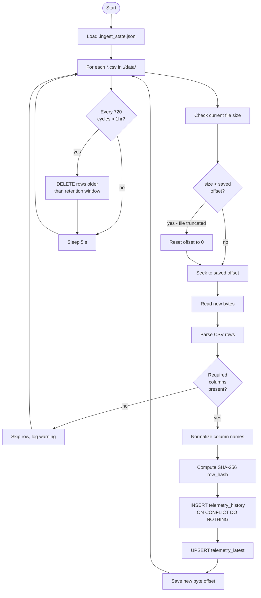

# 04 · Ingestion Engine

## What It Is

`scripts/ingest_csv_to_postgres.py` is a single Python process that runs in an infinite loop. Every 5 seconds it reads new rows from CSV files and writes them to PostgreSQL.

It has two modes:
- `python scripts/ingest_csv_to_postgres.py` — continuous watch mode (default)
- `python scripts/ingest_csv_to_postgres.py --once` — one-shot batch ingest, then exit

---

## The Main Loop



---

## ingest_file() in Detail

This is the core function. Here is what happens for each CSV file on each poll:

**1. Check byte offset**
```python
saved_offset = state.get(file_path, 0)
current_size = os.path.getsize(file_path)

if current_size < saved_offset:
    saved_offset = 0  # file was truncated, re-read from start
```

**2. Read new bytes only**
```python
with open(file_path, 'r') as f:
    if saved_offset == 0:
        f.seek(0)        # includes header row
    else:
        f.seek(saved_offset)  # skip to new content
    new_content = f.read()
```

**3. Parse as CSV**
If `saved_offset == 0`, the header is present and `pandas.read_csv` works normally. If `saved_offset > 0`, we're reading mid-file with no header, so the header is passed explicitly from the first read.

**4. Validate columns**
Required columns: `timestamp`, `satellite`, `subsystem`, `metric_name`, `metric_value`, `status`

Rows with missing values in required columns are dropped. No partial inserts.

**5. Normalize**
```python
df = df.rename(columns={
    'timestamp': 'observed_at',
    'satellite': 'spacecraft',
    'metric_name': 'signal_name',
    'metric_value': 'signal_value',
})
df['observed_at'] = pd.to_datetime(df['observed_at'], utc=True)
df['signal_value'] = pd.to_numeric(df['signal_value'], errors='coerce')
df['source_file'] = os.path.basename(file_path)
```

**6. Compute row hashes**
```python
df['row_hash'] = df.apply(
    lambda r: sha256(
        f"{r.observed_at}{r.spacecraft}{r.subsystem}"
        f"{r.signal_name}{r.signal_value}{r.status}".encode()
    ).hexdigest(),
    axis=1
)
```

**7. Insert into telemetry_history**
```python
# Uses executemany for batch inserts
cursor.executemany("""
    INSERT INTO telemetry_history
      (observed_at, spacecraft, subsystem, apid, signal_name,
       signal_value, signal_unit, status, source_file, row_hash)
    VALUES (%s, %s, %s, %s, %s, %s, %s, %s, %s, %s)
    ON CONFLICT (row_hash) DO NOTHING
""", rows)
```

**8. Upsert into telemetry_latest**
```python
cursor.executemany("""
    INSERT INTO telemetry_latest
      (spacecraft, subsystem, signal_name, apid, signal_value,
       signal_unit, status, observed_at, updated_at)
    VALUES (%s, %s, %s, %s, %s, %s, %s, %s, NOW())
    ON CONFLICT (spacecraft, subsystem, signal_name) DO UPDATE SET
      signal_value = EXCLUDED.signal_value,
      status       = EXCLUDED.status,
      observed_at  = EXCLUDED.observed_at,
      updated_at   = NOW()
""", rows)
```

**9. Update state**
```python
state[file_path] = current_size  # save new byte offset
save_state(state)                # write .ingest_state.json
```

---

## Error Handling

- **File not found:** Skipped silently (file may not exist yet)
- **Parse errors:** Row is skipped; warning logged; other rows in batch still processed
- **DB connection error:** Exception propagates, process crashes; Docker restart policy handles recovery
- **Duplicate rows:** `ON CONFLICT DO NOTHING` absorbs them; no error, no double-insert

---

## State File

`.ingest_state.json` is written after every successful poll cycle. It's excluded from git (`.gitignore`). Its only purpose is to survive process restarts without re-reading entire files.

If you delete it, the ingestor re-reads all CSVs from byte 0. Duplicates are absorbed by the hash constraint. The only cost is time to re-hash and attempt-insert all historical rows.

---

## The Simulator (`simulate_telemetry.py`)

The simulator is a companion process that generates synthetic data for the ingestor to consume. It is not part of the ingest pipeline itself.

**How it generates signals:**

```python
# Battery voltage on a 90-minute orbital cycle
base_voltage = 28.5
orbital_period = 5400  # seconds
phase = (time.time() % orbital_period) / orbital_period * 2 * pi
value = base_voltage + 2.0 * sin(phase) + random.gauss(0, 0.1)
```

- **Sinusoidal baseline:** Simulates eclipse/sun transitions as the satellite orbits
- **Gaussian noise:** Adds realistic sensor jitter
- **Phase offsets:** Sat-B runs at a different orbital phase than Sat-A
- **Degradation:** Sat-B has slightly worse nominal values to make fleet comparisons interesting

**Status assignment:**
```python
if value < CRITICAL_THRESHOLD:
    status = 'CRITICAL'
elif value < WARNING_THRESHOLD:
    status = 'WARNING'
else:
    status = 'NOMINAL'
```

Thresholds are defined per signal in a constants dict at the top of the script.

The simulator appends rows to the CSV files in `./data/` every 5 seconds, then the ingestor picks them up on its next poll cycle.

---

## The Fake Data Generator (`generate_fake_data.py`)

Used to pre-populate the database with historical data, useful for:
- Setting up dashboards with data already visible
- Testing retention/purge behavior
- Demos that need historical trend data

```bash
python scripts/generate_fake_data.py --days 30 --interval-minutes 5
```

This script:
1. **Wipes all existing CSVs** in `./data/`
2. **Clears `.ingest_state.json`** so the ingestor re-ingests from byte 0
3. Generates N days of data at M-minute intervals
4. Writes to CSVs, then the ingestor must be run (`--once`) to load into Postgres

It does **not** write directly to Postgres. It writes CSVs, which the ingestor then processes.

---

Next: [05 · Grafana Integration →](05-grafana-integration.md)
