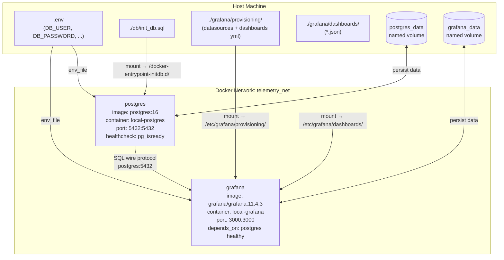
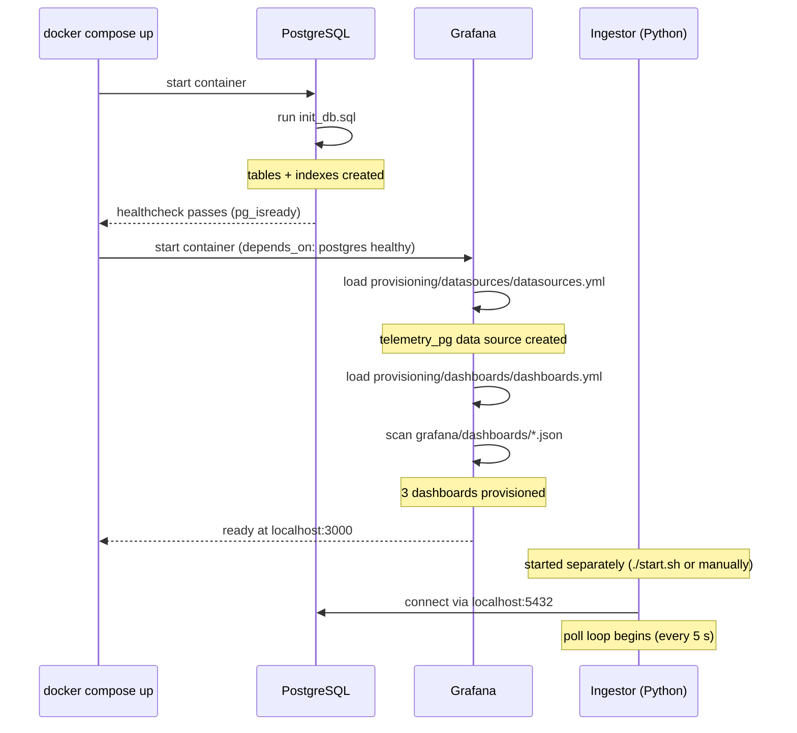

# 06 · Configuration & Deployment

## Environment Variables

Copy `.env.example` to `.env` and edit before first run:

```bash
cp .env.example .env
```

| Variable | Default | Used by |
|----------|---------|---------|
| `DB_USER` | `grafana_user` | Postgres, ingestor |
| `DB_PASSWORD` | `grafana_password` | Postgres, ingestor |
| `DB_HOST` | `localhost` | Ingestor (use `postgres` inside Docker) |
| `DB_PORT` | `5432` | Ingestor |
| `DB_NAME` | `local_csv_db` | Postgres, ingestor |
| `TELEMETRY_RETENTION_DAYS` | `30` | Ingestor purge loop |

Note: The Grafana data source config (`datasources.yml`) hardcodes `grafana_user` / `grafana_password`. If you change those `.env` values, also update the datasource YAML and restart Grafana.

---

## Docker Compose Architecture



**Named volumes** (`postgres_data`, `grafana_data`) persist data between `docker compose stop/start`. They are destroyed by `docker compose down -v`.

**The health check matters.** Grafana waits for Postgres to pass `pg_isready` before starting. This prevents Grafana from booting with a missing data source, which would require a manual datasource reload.

---

## Startup Sequence

**Quick start (all-in-one script):**

```bash
# macOS / Linux
./start.sh

# Windows PowerShell
.\start.ps1
```

Both scripts do the same four things:
1. `docker compose up -d` — start Postgres + Grafana
2. Poll `pg_isready` for up to 45 seconds, exit if Postgres doesn't come up
3. `pip install -r requirements.txt` — install Python dependencies
4. `python scripts/ingest_csv_to_postgres.py` — start the ingestor in watch mode

**Manual startup (for more control):**

```bash
# Terminal 1: start containers
docker compose up -d

# Terminal 2: start ingestor (watch mode)
python scripts/ingest_csv_to_postgres.py

# Terminal 3 (optional): generate live telemetry
python scripts/simulate_telemetry.py
```

Running the ingestor and simulator in separate terminals lets you kill/restart them independently.

---

## Startup Order Dependencies



The ingestor connects to `localhost:5432` by default (i.e., the Docker-mapped port on your host machine). Grafana connects to `postgres:5432` (Docker internal hostname). Both reach the same Postgres container.

---

## Port Map

| Port | Service | Access |
|------|---------|--------|
| 5432 | PostgreSQL | `localhost:5432` from host; `postgres:5432` inside Docker |
| 3000 | Grafana | `http://localhost:3000` from host |

---

## Python Dependencies

```
pandas          # CSV parsing, dataframe operations
psycopg2-binary # PostgreSQL driver (binary = no compile needed)
python-dotenv   # Load .env file into os.environ
sqlalchemy      # SQL construction + connection pooling
```

Install with:
```bash
pip install -r requirements.txt
```

Using a virtual environment is recommended:
```bash
python -m venv .venv
source .venv/bin/activate  # macOS/Linux
.venv\Scripts\Activate.ps1  # Windows
pip install -r requirements.txt
```

---

## Stopping the System

```bash
# Stop containers, keep volumes (data preserved)
docker compose stop

# Stop containers, remove containers but keep volumes
docker compose down

# Stop containers, remove containers AND volumes (wipes all data)
docker compose down -v
```

The Python ingestor is a foreground process. Kill it with `Ctrl+C`. State is saved to `.ingest_state.json` on each cycle, so a clean shutdown loses at most 5 seconds of offset tracking (harmless—duplicates are absorbed by the hash constraint).

---

Next: [07 · Operations Runbook →](07-operations-runbook.md)
