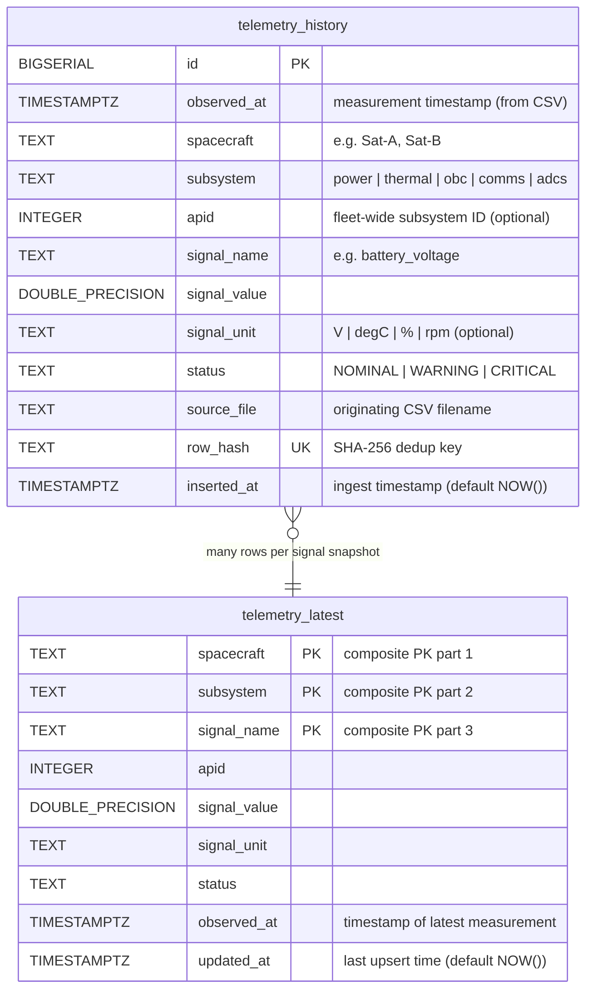
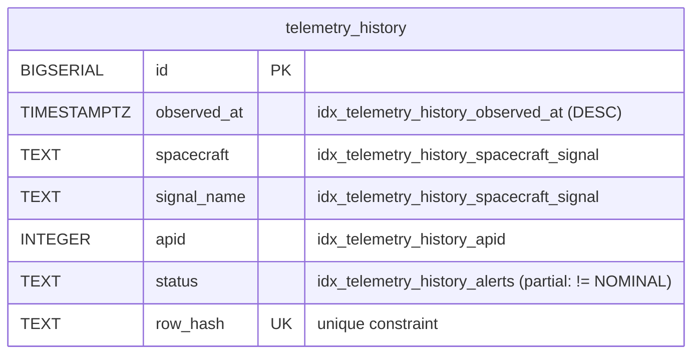
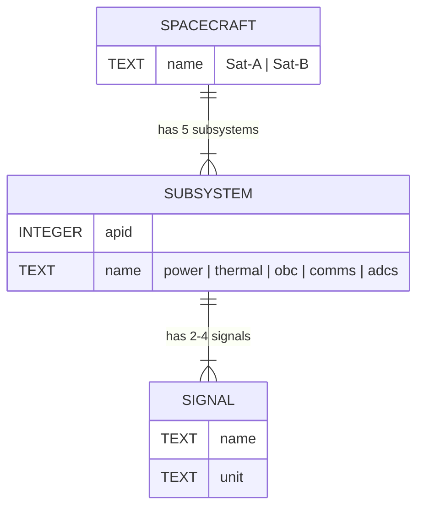

# 08 · Entity Relationship Diagram

## Database ERD



---

## Relationship Explained

There is no enforced foreign key between the two tables. The relationship is **logical**, not referential:

- `telemetry_latest` holds exactly one row per `(spacecraft, subsystem, signal_name)` triple.
- `telemetry_history` holds every row ever ingested for that triple.
- When a new reading arrives, it is **appended** to `telemetry_history` and **overwrites** the matching row in `telemetry_latest`.

Think of `telemetry_latest` as a **materialized current-state view** of `telemetry_history`. It could be implemented as a view with `DISTINCT ON`, but a physical table with upserts is faster for Grafana's real-time queries.

---

## Index Map



| Index | Columns | Type | Purpose |
|-------|---------|------|---------|
| `idx_telemetry_history_observed_at` | `(observed_at DESC)` | Full | Time-range scans for all Grafana time-series panels |
| `idx_telemetry_history_spacecraft_signal` | `(spacecraft, signal_name, observed_at DESC)` | Full | Per-spacecraft, per-signal trend queries |
| `idx_telemetry_history_apid` | `(apid, observed_at DESC)` | Full | Fleet-wide subsystem queries grouped by APID |
| `idx_telemetry_history_alerts` | `(spacecraft, signal_name, observed_at DESC) WHERE status != 'NOMINAL'` | **Partial** | Alert queries — only indexes ~5% of rows |
| `telemetry_history_row_hash_key` | `(row_hash)` | Unique | Deduplication enforcement |
| `telemetry_latest_pkey` | `(spacecraft, subsystem, signal_name)` | Primary | Upsert target |

---

## Signal Topology ERD

How spacecraft, subsystems, and signals relate conceptually (not physical tables — these are embedded in the TEXT columns):



| Spacecraft | APID | Subsystem | Signals |
|-----------|------|-----------|---------|
| Sat-A, Sat-B | 100 | power | battery_voltage (V), solar_current (A) |
| Sat-A, Sat-B | 101 | thermal | panel_temp (°C), cpu_temp (°C) |
| Sat-A, Sat-B | 102 | obc | cpu_usage (%), memory_usage (%) |
| Sat-A, Sat-B | 103 | comms | link_quality (%), downlink_rate_kbps (kbps) |
| Sat-A, Sat-B | 104 | adcs | reaction_wheel_rpm, magnetometer_nt, attitude_error_deg, gyro_rate_dps |

10 CSV files total: 2 spacecraft × 5 APIDs.  
~30 signals total: 2 spacecraft × (2+2+2+2+4) signals.

---

## Data Volume Model

At steady state with 30-day retention and 5-second polling:

```
30 signals x 12 readings/min x 60 min/hr x 24 hr/day x 30 days = ~15.5M rows
~200 bytes/row (including index overhead) = ~3 GB total
```

`telemetry_latest` stays fixed at ~30 rows regardless of retention window.

---

← [07 · Operations Runbook](07-operations-runbook.md) | [Wiki Index →](README.md)
